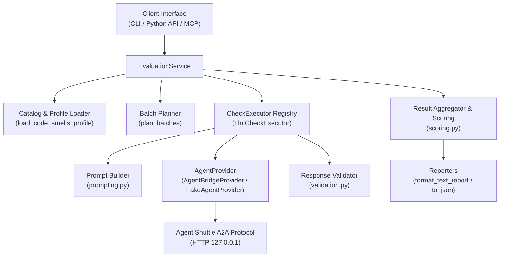
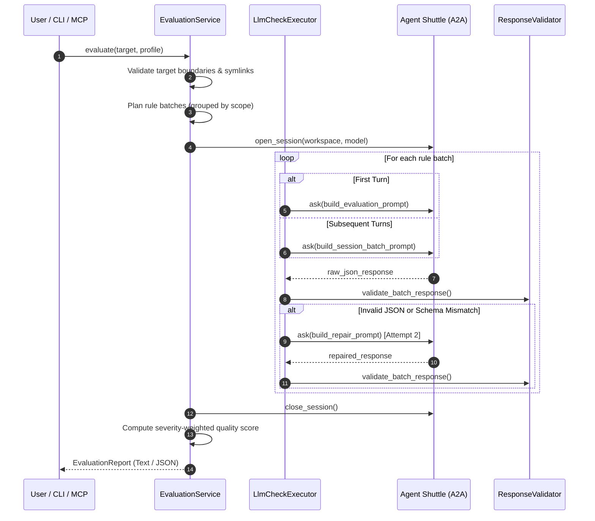

# Architecture and Internal Execution Flow

[English](architecture.md) | [Русский](ru/architecture.md)

This document details the architectural design, execution pipeline, protocol boundaries, and extension points of **Qriterra**.

---

## 1. System Overview

Qriterra is structured as a decoupled evaluation engine that isolates domain logic (smells, scoring, batching) from agent execution transport:



---

## 2. End-to-End Evaluation Lifecycle

The complete evaluation lifecycle proceeds through seven distinct stages:



### Stage 1: Target Validation
- `EvaluationTarget` factory methods validate the target.
- For `file`: verifies the file exists and is under 1,000,000 bytes.
- For `project`: verifies the directory exists and traverses all files to ensure no symlinks point outside the project boundary.

### Stage 2: Batch Planning
- `plan_batches(rules, batch_size)` groups rules by their `scope` (`method`, `class`, `file`, etc.).
- Rules within the same scope are sliced into sequential batches of at most `batch_size` (default: 10).
- Rules never mix scopes in a single batch, preserving mental context for the model.

### Stage 3: Session Management
- For multi-batch runs or project evaluations, `EvaluationService` establishes a persistent conversation session via `provider.open_session()`.
- The chosen `model` and `reasoning_effort` are bound to the session and verified on every turn.

### Stage 4: Prompt Construction
- **First Turn**: `build_evaluation_prompt` transmits the target content (for snippets/files) or path/tool guidelines (for projects) alongside the initial batch rules.
- **Subsequent Turns**: `build_session_batch_prompt` sends only the new rule definitions, relying on the agent's active conversational memory to retain code context and boundary rules.

### Stage 5: Response Validation and Self-Repair
- Raw LLM responses are parsed strictly against Schema 1.0 (snippets/files) or Schema 2.0 (projects).
- If parsing fails (malformed JSON, missing rules, hallucinated code citations, invalid status):
  1. An event `validation_failed` is emitted.
  2. `build_repair_prompt` sends the error and invalid response back to the model for a **single repair attempt**.
  3. If the repair succeeds, evaluation continues normally.
  4. If the repair fails, the batch rules are recorded with status `error`.

### Stage 6: Scoring and Aggregation
- `summarize()` calculates severity-weighted quality scores (`low=1`, `medium=2`, `high=3`, `critical=5`).
- Enforces strict safety rules: if any batch failed with `error`, or if any project rule has `partial` coverage, the `quality_score` is set to `null` to avoid misleading metrics.

### Stage 7: Report Generation
- `EvaluationReport` serializes results into human-readable text (`format_text_report`) or structured JSON with complete `debug_trace` events.

---

## 3. Extension Points

Qriterra is designed for modular expansion without modifying the core orchestration pipeline.

### Extension Point 1: `CheckExecutor` Protocol
The engine interacts with checks through the abstract `CheckExecutor` protocol:

```python
class CheckExecutor(Protocol):
    id: str
    async def execute(self, request: BatchRequest) -> tuple[CheckResult, ...]: ...
```

In the current version, all rules specify `executor="llm"`, which delegates to `LlmCheckExecutor`. Future extensions can register specialized non-LLM executors:
- Static analysis and AST linters (e.g. `RuffCheckExecutor`, `MypyCheckExecutor`).
- Performance benchmarks and dynamic test runners.
- Architecture diagram validators.

Because every executor returns standardized `CheckResult` tuples, scoring and reporting remain completely unified.

### Extension Point 2: `AgentProvider` Protocol
The communication layer with language models is abstracted behind `AgentProvider`:

```python
class AgentProvider(Protocol):
    capabilities: ProviderCapabilities

    def descriptor(self, model: str | None = None, reasoning_effort: str | None = None) -> ProviderDescriptor: ...

    async def run(
        self, prompt: str, *, workspace: Path | None,
        model: str | None = None, reasoning_effort: str | None = None,
    ) -> str | ProviderResponse: ...
```

To support a native LLM API (such as direct Google GenAI, OpenAI SDK, or Anthropic SDK) without Agent Shuttle, one simply implements this protocol and passes the provider to `EvaluationService`.

### Extension Point 3: Custom Evaluation Profiles
New rule domains (e.g., security vulnerabilities, performance anti-patterns, API design guidelines) can be loaded through `load_code_smells_profile(catalog_path=...)` without altering any Python code.
