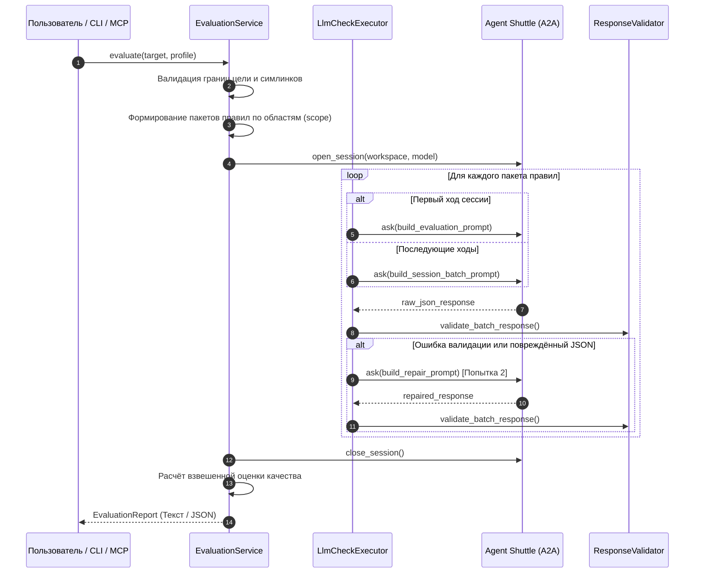

# Архитектура и внутренний поток исполнения

[English](../architecture.md) | [Русский](architecture.md)

В этом документе подробно описаны архитектурные компоненты, конвейер исполнения, границы протоколов и точки расширения **Qriterra**.

---

## 1. Обзор системы

Архитектура Qriterra построена на строгом разделении доменной логики (правила, метрики, оценки) и транспорта выполнения агентных задач:

```mermaid
flowchart TD
    Client["Клиентский интерфейс\n(CLI / Python API / MCP)"] --> Service["EvaluationService"]
    Service --> Catalog["Загрузчик каталога и профилей\n(load_code_smells_profile)"]
    Service --> Batcher["Планировщик пакетов\n(plan_batches)"]
    Service --> Executor["Реестр CheckExecutor\n(LlmCheckExecutor)"]
    Executor --> Prompt["Генератор промптов\n(prompting.py)"]
    Executor --> Provider["AgentProvider\n(AgentBridgeProvider / FakeAgentProvider)"]
    Provider --> A2A["Протокол Agent Shuttle A2A\n(HTTP 127.0.0.1)"]
    Executor --> Validator["Валидатор ответов\n(validation.py)"]
    Service --> Aggregator["Агрегатор результатов и оценка\n(scoring.py)"]
    Aggregator --> Reporter["Генераторы отчётов\n(format_text_report / to_json)"]
```



---

## 2. Полный жизненный цикл проверки

Процесс выполнения проверки состоит из семи последовательных этапов:



### Этап 1: Валидация цели
- Фабричные методы `EvaluationTarget` проверяют тип и границы цели.
- Для `file`: проверяется существование файла и ограничение размера в 1 000 000 байт.
- Для `project`: проверяется каталог и отсутствие символических ссылок, ведущих наружу.

### Этап 2: Планирование пакетов
- Функция `plan_batches(rules, batch_size)` группирует правила по их области (`scope`: методы, классы, файлы и т.д.).
- Внутри каждой группы правила разбиваются на пакеты размером не более `batch_size` (по умолчанию: 10).
- Правила разных уровней никогда не смешиваются в одном пакете.

### Этап 3: Управление сессией
- Для многопакетных запусков и проектов `EvaluationService` открывает сессию в Agent Shuttle через `provider.open_session()`.
- Выбранные параметры `model` и `reasoning_effort` фиксируются за сессией и проверяются на каждом шаге.

### Этап 4: Построение промпта
- **Первый ход**: `build_evaluation_prompt` передаёт целевой код (для сниппетов/файлов) или путь и инструкции по инструментам (для проектов) вместе с первым пакетом правил.
- **Последующие ходы**: `build_session_batch_prompt` передаёт только определения новых правил, опираясь на контекстную память диалога.

### Этап 5: Валидация и самовосстановление ответа
- Ответ парсится согласно Схеме 1.0 (сниппеты/файлы) или Схеме 2.0 (проекты).
- При нарушении формата (невалидный JSON, несовпадение rule ID, выдуманный код в цитатах, некорректный статус):
  1. Генерируется отладочное событие `validation_failed`.
  2. `build_repair_prompt` отправляет ошибку обратно модели для **одной попытки исправления**.
  3. Если исправленный ответ валиден, выполнение продолжается.
  4. Если повторная попытка не удалась, правила пакета получают статус `error`.

### Этап 6: Оценка и агрегация
- Функция `summarize()` вычисляет оценку с учётом весов критичности (`low=1`, `medium=2`, `high=3`, `critical=5`).
- Применяются правила безопасности: при наличии ошибок `error` или неполного охвата `partial` в проекте итоговая оценка `quality_score` обнуляется в `null`, чтобы исключить ложную уверенность.

### Этап 7: Генерация отчётов
- `EvaluationReport` сериализует итоги в человекочитаемый текст (`format_text_report`) или структурированный JSON с полной трассировкой `debug_trace`.

---

## 3. Точки расширения для разработчиков

Архитектура библиотеки рассчитана на добавление новых возможностей без переписывания ядра:

### 1. Протокол `CheckExecutor`
Вся работа с проверками абстрагирована за протоколом `CheckExecutor`:

```python
class CheckExecutor(Protocol):
    id: str
    async def execute(self, request: BatchRequest) -> tuple[CheckResult, ...]: ...
```

В текущей версии все правила каталога имеют `executor="llm"`, что делегирует работу `LlmCheckExecutor`. В будущем можно подключить специализированные не-LLM исполнители:
- Статические анализаторы и линтеры (Ruff, Mypy).
- Запуск тестов производительности и бенчмарков.
- Проверку архитектурных зависимостей.

Все исполнители возвращают единый кортеж `CheckResult`, поэтому логика скоринга и отчёты останутся полностью совместимыми.

### 2. Протокол `AgentProvider`
Слой коммуникации с языковыми моделями инкапсулирован в интерфейсе `AgentProvider`:

```python
class AgentProvider(Protocol):
    capabilities: ProviderCapabilities

    def descriptor(self, model: str | None = None, reasoning_effort: str | None = None) -> ProviderDescriptor: ...

    async def run(
        self, prompt: str, *, workspace: Path | None,
        model: str | None = None, reasoning_effort: str | None = None,
    ) -> str | ProviderResponse: ...
```

Для подключения прямого вызова LLM API (Google GenAI, OpenAI SDK, Anthropic SDK) без Agent Shuttle достаточно реализовать этот протокол и передать экземпляр в `EvaluationService`.

### 3. Пользовательские профили проверок
Новые базы правил (безопасность, специфичные антипаттерны фреймворка, стиль API) подключаются через `load_code_smells_profile(catalog_path=...)` без изменения кода библиотеки.
